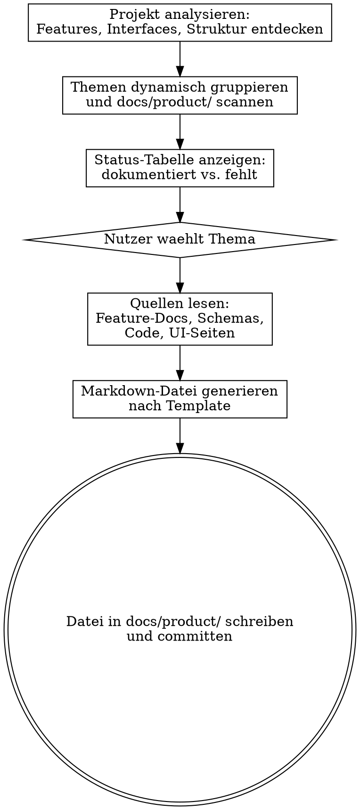

# Produktdokumentation generieren

Erstelle fachliche Produktdokumentation fuer das Produkt aus Nutzerperspektive. Die Dokumentation beschreibt welche Probleme geloest werden, welche Features es gibt, und wie man sie ueber die verschiedenen Interfaces (Frontend, API, CLI, MCP) anwendet.

Der Skill ist projektunabhaengig — er analysiert die Codebasis dynamisch und leitet Themen, Features und Interfaces selbst ab.

## Prozess



## Schritt 1: Projekt analysieren

Untersuche die Codebasis um Features, Interfaces und Struktur zu verstehen:

### Feature-Erkennung

Suche nach Feature-Dokumentation in dieser Reihenfolge:
1. `docs/features/` — Feature-Spezifikationen (mit Nummern, Abhaengigkeiten, Status)
2. `docs/` — andere Dokumentationsverzeichnisse
3. `README.md`, `CLAUDE.md`, `AGENTS.md` — Projektbeschreibung und Feature-Listen
4. Quellcode-Struktur — Module, Packages, Service-Klassen

Fuer jedes gefundene Feature ermittle:
- **Name und Beschreibung** — was tut es fachlich?
- **Implementierungsstatus** — gibt es eine Done-Datei, ist Code vorhanden?
- **Zugehoerige Interfaces** — ueber welche Wege ist es nutzbar?

### Interface-Erkennung

Suche nach verfuegbaren Interfaces:
- **Frontend:** `frontend/`, `web/`, `client/`, `app/` — Seiten, Komponenten, Routes
- **REST API:** OpenAPI/Swagger-Specs, Controller-Klassen, `@RestController`, `@RequestMapping`
- **GraphQL API:** `.graphqls`-Schemas, `@QueryMapping`, `@MutationMapping`
- **CLI:** CLI-Frameworks (Clikt, Picocli, Commander), `@Command`-Annotationen
- **MCP:** `@McpTool`, MCP-Server-Konfiguration
- **SDK/Library:** Oeffentliche API-Klassen, exportierte Module

### Themen-Gruppierung

Gruppiere die gefundenen Features in fachliche Themen. Orientiere dich dabei an:
- **Fachliche Zusammengehoerigkeit** — Features die dasselbe Problem loesen gehoeren zusammen
- **Nutzer-Workflows** — Features die typischerweise zusammen verwendet werden
- **3-8 Themen** — nicht zu wenige (zu grob), nicht zu viele (unuebersichtlich)

Erzeuge fuer jedes Thema:
- Einen sprechenden Namen (z.B. "Dokumentenverwaltung", "Suche & Abfragen")
- Einen Dateinamen in kebab-case (z.B. `dokumentenverwaltung.md`, `suche-und-abfragen.md`)
- Die Liste der zugehoerigen Features

Plus immer diese festen Themen:
- **Ueberblick** (`index.md`) — Einstiegsseite mit Produktbeschreibung und Themenuebersicht
- **Erste Schritte** (`erste-schritte.md`) — Get-Started-Anleitung: Installation, Setup, erster Workflow von A bis Z
- **Tutorials & Best Practices** (`tutorials-und-best-practices.md`) — Schritt-fuer-Schritt-Anleitungen fuer typische Anwendungsfaelle und bewaehrte Vorgehensweisen
- **Troubleshooting** (`troubleshooting.md`) — Haeufige Probleme, Fehlermeldungen und deren Loesungen
- **Changelog** (`changelog.md`) — Aenderungshistorie aus Nutzersicht, abgeleitet aus der Git-History

## Schritt 2: Status ermitteln

Pruefe fuer jedes Thema ob die Datei in `docs/product/` bereits existiert.

Zeige dem Nutzer die Tabelle:

| # | Thema | Datei | Features | Status |
|---|---|---|---|---|
| 1 | Ueberblick | `index.md` | — | dokumentiert / fehlt |
| 2 | Erste Schritte | `erste-schritte.md` | — | dokumentiert / fehlt |
| 3 | Tutorials & Best Practices | `tutorials-und-best-practices.md` | — | dokumentiert / fehlt |
| 4 | <Thema> | `<datei>.md` | Feature A, B, C | dokumentiert / fehlt |
| ... | ... | ... | ... | ... |
| N-1 | Troubleshooting | `troubleshooting.md` | — | dokumentiert / fehlt |
| N | Changelog | `changelog.md` | — | dokumentiert / fehlt |

Falls der Nutzer bereits ein Thema als Argument uebergeben hat, ueberspringe die Auswahl.

Falls ein Thema bereits dokumentiert ist und der Nutzer es erneut waehlt, frage ob er aktualisieren moechte.

## Schritt 3: Quellen lesen

Lies fuer das gewaehlte Thema alle zugehoerigen Quellen:
- **Feature-Dokumentation** — Specs, Done-Files, READMEs
- **API-Schemas** — GraphQL-Schemas, OpenAPI-Specs, Protobuf-Definitionen
- **UI-Code** — Seiten, Komponenten, Routes (fuer Frontend-Beschreibungen)
- **CLI-Code** — Befehle, Hilfe-Texte, Query-Definitionen
- **Tool-Definitionen** — MCP-Tools, Agent-Tools mit Beschreibungen

Konzentriere dich auf die **oeffentlichen Schnittstellen** — was der Nutzer sieht und aufruft, nicht die interne Implementierung.

## Schritt 4: Dokumentation generieren

Generiere die Markdown-Datei nach folgendem Template. Schreibe auf Deutsch, aus Nutzerperspektive.

### Template fuer Themen-Dateien

```markdown
# <Themenname>

## Ueberblick

Was dieses Themengebiet abdeckt und welche Probleme es loest.
Kurze Einordnung in den Gesamtkontext des Produkts.

## Features

### <Feature-Name>

**Problem:** Welches konkrete Problem wird geloest?

**Loesung:** Was bietet das Produkt dafuer?

#### Anwendung

(Nur die Interfaces beschreiben, die fuer dieses Feature tatsaechlich existieren.
Interface-Abschnitte weglassen, wenn das Feature dort nicht verfuegbar ist.)

- **Frontend:** Wie nutzt man es in der UI — Seitenpfad, Bedienelemente, Ablauf
- **API:** Endpoints/Queries/Mutations mit konkreten Beispiel-Aufrufen
- **CLI:** Befehle mit konkreten Beispiel-Aufrufen
- **MCP:** Tool-Aufrufe mit Parametern

#### Beispiel

Konkretes Anwendungsszenario mit nummerierten Schritten:
1. Schritt eins...
2. Schritt zwei...
3. Ergebnis...

---

(naechstes Feature im Themengebiet)
```

### Template fuer Erste Schritte (erste-schritte.md)

```markdown
# Erste Schritte

## Voraussetzungen

Was muss installiert/konfiguriert sein, bevor man starten kann?

## Installation & Setup

Schritt-fuer-Schritt-Anleitung um das Produkt zum Laufen zu bringen.

## Ihr erster Workflow

Kompletter Durchlauf eines typischen Anwendungsfalls von Anfang bis Ende:
1. Schritt eins...
2. Schritt zwei...
3. Ergebnis...

## Naechste Schritte

Verweise auf die Themen-Dokumentation fuer tiefere Einarbeitung.
```

### Template fuer Tutorials & Best Practices (tutorials-und-best-practices.md)

```markdown
# Tutorials & Best Practices

## Tutorials

### <Tutorial-Name>

**Ziel:** Was lernt man in diesem Tutorial?

**Voraussetzungen:** Was muss bereits eingerichtet sein?

#### Schritt-fuer-Schritt

1. ...
2. ...
3. ...

#### Ergebnis

Was hat man nach Abschluss des Tutorials erreicht?

---

(naechstes Tutorial)

## Best Practices

### <Thema>

**Empfehlung:** Was sollte man tun?

**Grund:** Warum ist das wichtig?

**Beispiel:** Konkretes Beispiel.

---

(naechste Best Practice)
```

### Template fuer Troubleshooting (troubleshooting.md)

```markdown
# Troubleshooting

## Haeufige Probleme

### <Fehlerbild / Symptom>

**Symptom:** Was sieht der Nutzer? (Fehlermeldung, unerwartetes Verhalten)

**Ursache:** Was ist die typische Ursache?

**Loesung:**
1. Schritt eins...
2. Schritt zwei...

---

(naechstes Problem)
```

Quellen fuer Troubleshooting-Inhalte:
- Bekannte Fehler aus Issues, Bug-Fixes in der Git-History (`git log --grep="fix"`)
- Error-Handling-Code im Projekt (Exceptions, Fehlermeldungen)
- Konfigurationsfehler die aus der `application.yml` / Config-Dateien ableitbar sind

### Template fuer Changelog (changelog.md)

```markdown
# Changelog

## <Monat Jahr> (z.B. April 2026)

### Neue Features
- <Kurzbeschreibung was der Nutzer jetzt tun kann>
- ...

### Verbesserungen
- <Was wurde besser/schneller/einfacher>
- ...

### Fehlerbehebungen
- <Welches Problem wurde behoben>
- ...

---

(naechster Monat)
```

**Regeln fuer den Changelog:**
- Quelle ist `git log` — lies die Commit-History und gruppiere nach Monat
- **Keine Commit-IDs, keine Branch-Namen, keine technischen Details**
- Commits in nutzersichtbare Aenderungen uebersetzen: `feat(topic): add TopicExtractorService` wird zu "Automatische Themenextraktion aus Dokumenten hinzugefuegt"
- Reine Refactoring-, Test- oder Build-Commits weglassen — nur was den Nutzer betrifft
- Gruppierung: Neue Features, Verbesserungen, Fehlerbehebungen
- Chronologisch absteigend (neueste zuerst)

### Template fuer Ueberblick (index.md)

```markdown
# <Produktname> Produktdokumentation

## Was ist <Produktname>?

Kurze Beschreibung der Plattform und ihrer Kernidee.

## Welche Probleme loest <Produktname>?

Auflistung der Hauptprobleme mit kurzer Erklaerung.

## Themengebiete

| Thema | Beschreibung | Status |
|---|---|---|
| [<Thema>](<datei>.md) | ... | implementiert / geplant |
| ... | ... | ... |

## Erste Schritte

Kurzanleitung fuer den typischen Einstiegs-Workflow.
```

## Schritt 5: Datei schreiben und committen

1. Schreibe die generierte Datei nach `docs/product/<dateiname>.md`
2. Committe mit: `docs(product): add <thema> documentation`

## Regeln fuer die Generierung

- **Sprache:** Deutsch
- **Perspektive:** Nutzersicht, nicht Entwicklersicht
- **Keine interne Architektur:** Keine Package-Namen, keine Klassennamen, keine Message-Broker-Topics, keine Datenbank-Details
- **Konkrete Beispiele:** Jedes Feature bekommt mindestens ein Anwendungsszenario
- **Nur implementierte Features:** Nur Features die tatsaechlich implementiert sind als vollstaendig dokumentieren. Geplante Features als "geplant" erwaehnen wenn sie zum Thema gehoeren.
- **Interface-Abschnitte nur wenn vorhanden:** Keinen Interface-Abschnitt zeigen wenn das Feature dort nicht verfuegbar ist
- **Echte API-Beispiele:** Queries/Mutations/Endpoints aus den tatsaechlichen Schema-Dateien verwenden, keine erfundenen
- **Abweichungen beachten:** Wenn Done-Files oder Code von der Feature-Dokumentation abweichen, den tatsaechlichen Stand dokumentieren
- **Keine Duplikation:** Features die in mehreren Themen relevant sind, im Hauptthema ausfuehrlich und in anderen Themen nur kurz mit Verweis dokumentieren

ARGUMENTS: Thema als optionales Argument (Nummer oder Name), z.B. `/product-docs 3` oder `/product-docs Wissensextraktion`
