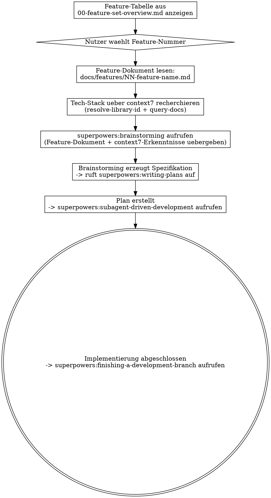

# Feature implementieren

Waehle ein Feature aus diesem Projekt-Feature-Set, recherchiere die Technik mit context7 und implementiere es anschliessend Ende-zu-Ende mit Superpowers.

## Prozess

## Schritt 1: Feature-Auswahl

Lies `docs/features/00-feature-set-overview.md` und praesentiere dem Nutzer die Feature-Tabelle. Zeige Phase, Nummer, Name, Abhaengigkeiten und Aufwand. Der Nutzer soll per Nummer auswaehlen.

Falls der Nutzer bereits eine Feature-Nummer oder einen Namen angegeben hat, ueberspringe die Auswahl.

## Schritt 2: Feature-Dokument lesen

Lies das vollstaendige Feature-Dokument unter `docs/features/NN-feature-name.md`. Extrahiere:
- Problem und Ziel
- Architektur und Datenmodelle
- Service-Schnittstellen und Implementierungen
- Aenderungen am GraphQL-Schema
- Betroffene Dateien
- Akzeptanzkriterien
- Abhaengigkeiten zu anderen Features

Pruefe, welche Abhaengigkeiten bereits implementiert sind, indem du die Codebasis durchsuchst (suche nach bestehenden Klassen, Interfaces und Services aus der Abhaengigkeitsliste).

## Schritt 3: Context7-Recherche

Recherchiere auf Basis der technischen Anforderungen des Features die aktuelle Dokumentation ueber context7:

1. **Bibliotheken identifizieren**, die das Feature verwendet (aus dem Feature-Dokument und dem Projekt-Tech-Stack)
2. **Library-IDs aufloesen** ueber `mcp__context7__resolve_library_id`
3. **Relevante Dokumentation abfragen** ueber `mcp__context7__query_docs`

Beispiel typische Bibliotheken je nach Feature-Typ:

| Feature-Typ | Zu recherchierende Bibliotheken |
|---|---|
| Storage (Cassandra, Qdrant, S3) | Spring Data Cassandra, Qdrant Java Client, AWS S3 SDK |
| LLM/KI | Spring AI (ChatClient, strukturiertes Output, Embeddings) |
| GraphQL API | Spring Boot GraphQL (@QueryMapping, Coroutines) |
| Kafka Messaging | Spring Kafka |
| Frontend | Next.js, React |

Zusaetzlich pruefen: Koog-Framework (die LLM-Abstraktion des Projekts), falls das Feature LLM-Aufrufe enthaelt.

Fasse die Erkenntnisse knapp zusammen. Konzentriere dich auf API-Muster, Kotlin-spezifische Aspekte und alles, was von den Annahmen im Feature-Dokument abweicht.

## Schritt 4: Brainstorming

**ERFORDERLICHE SUB-SKILL:** `superpowers:brainstorming` aufrufen

Uebergib dem Brainstorming-Skill:
- Den vollstaendigen Inhalt des Feature-Dokuments
- Die Ergebnisse der Context7-Recherche (relevante API-Muster, Stolperfallen)
- Den aktuellen Zustand der Codebasis (was bereits implementiert ist und was fehlt)
- Alle Abweichungen zwischen Feature-Dokument und tatsaechlichem Code (z. B. Paketnamen, Framework-Entscheidungen)

Der Brainstorming-Skill uebernimmt: Rueckfragen, Vorschlaege zur Herangehensweise, Darstellung des Designs, Spezifikationserstellung und Uebergabe an writing-plans.

## Schritt 5: Planung

Der Brainstorming-Skill ruft automatisch `superpowers:writing-plans` auf.

## Schritt 6: Implementierung

Sobald der Plan geschrieben ist, biete die Ausfuehrungswahl an:
- **Subagentengesteuert** `superpowers:subagent-driven-development`

## Schritt 7: Abschluss

**ERFORDERLICHE SUB-SKILL:** `superpowers:finishing-a-development-branch` aufrufen

**Feature done Datei:** schreibe eine `docs/features/NN-feature-name-done.md` mit:
- Kurze Zusammenfassung der Implementierung
- Alle Abweichungen vom urspruenglichen Plan oder Feature-Dokument
- Alle offenen Fragen oder technischen Schulden, die nach der Implementierung bestehen

## Wichtige Regeln

- **Immer context7 verwenden**, bevor Brainstorming startet. Verlasse dich bei Bibliotheks-APIs nicht auf Trainingsdaten.
- **Bestehenden Code pruefen**, bevor du annimmst, dass etwas von Grund auf neu gebaut werden muss.
- **Bestehenden Mustern folgen.** Folge Best Practices, Architektur- und Designentscheidungen, die in der Codebasis bereits etabliert sind.
- **Fertige Features nicht erneut implementieren.** Wenn bereits eine `docs/features/NN-feature-name-done.md` existiert, weise den Nutzer darauf hin und lies die Done-Datei, anstatt eine neue Implementierung zu starten.
